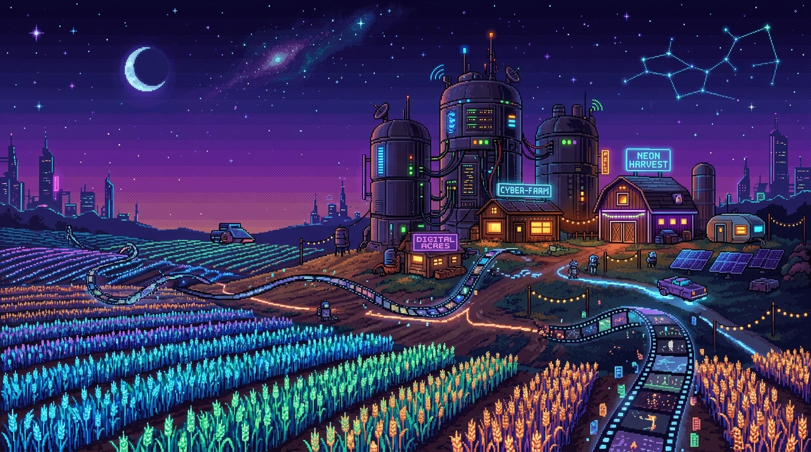
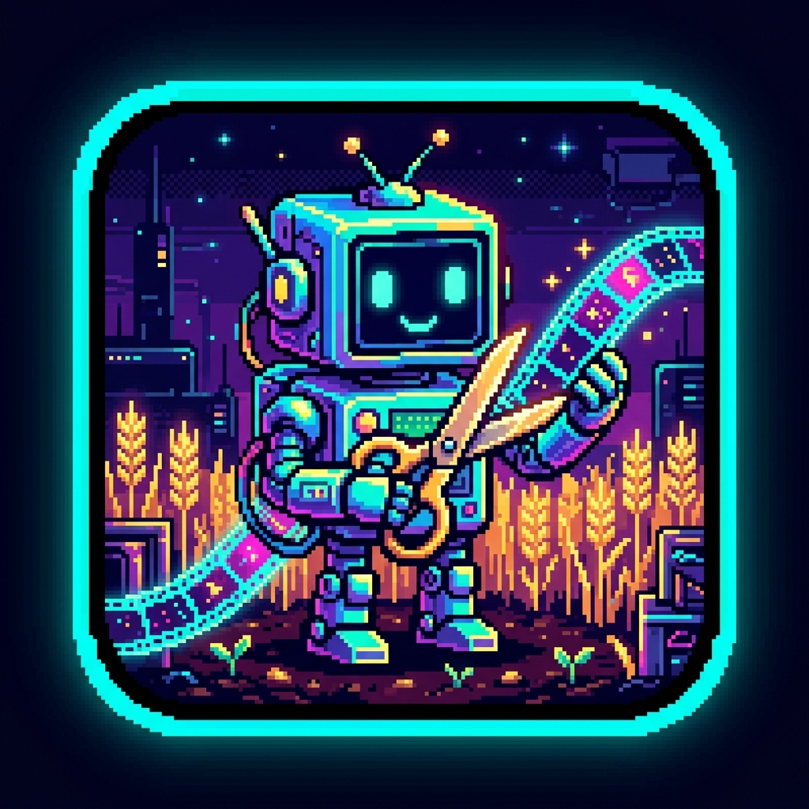
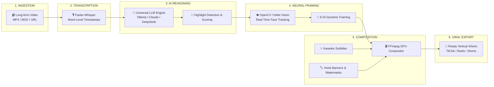

<div align="center">



# 🎬 ClipFarm Studio

### Turn long-form podcasts, interviews, and streams into viral 9:16 vertical clips with neural face tracking, karaoke subtitles, and 100% offline local AI.

<br/>

[](https://ko-fi.com/santima)

<br/>

[](https://python.org)
[](https://fastapi.tiangolo.com)
[](https://reactjs.org)
[](https://www.typescriptlang.org)
[](https://tauri.app)
[](https://ollama.com)
[](LICENSE)

<br/>

**[⚡ Quick Start](#-quick-start)** • 
**[✨ Why ClipFarm](#-why-clipfarm)** • 
**[🤖 11 AI Engines](#-universal-ai-engine-support)** • 
**[🔄 Architecture](#-pipeline-architecture)** • 
**[💻 Hardware Guide](#-hardware-guide)** • 
**[☕ Support](#-support-clipfarm)** • 
**[📄 License](#-license)**

</div>

---

## 🎯 Overview

**ClipFarm Studio** is an open-source, full-stack video clipping application designed for content creators, video agencies, and podcasters. It automates the entire vertical video production workflow:

1. **Ingest**: Download directly from YouTube, Bilibili, or upload local high-res MP4/MOV videos.
2. **Transcribe**: High-speed word-level transcription powered by local Faster-Whisper with zero cloud dependencies.
3. **Extract Highlights**: Natural moment detection, viral hook analysis, and virality scoring using any local or cloud LLM.
4. **Smart 9:16 Autoframing**: Neural face tracking (`yunet.onnx`) keeps the speaker dynamically framed in vertical 9:16.
5. **Burn Captions**: Word-level animated karaoke styling, dynamic hook banner headers, and background audio ducking.
6. **Campaign Monetization**: Parse sponsor briefs, detect product mentions, and inject animated call-to-action overlays.

---

## ✨ Why ClipFarm?

<table>
  <tr>
    <td width="32%" align="center" valign="top">
      
      <br/>
      <sub>🤖 <b>Clipper Bot</b> — Harvesting viral clips 24/7</sub>
    </td>
    <td width="68%" valign="top">
      <h3>Free, Private, and Universal</h3>
      <p>Most commercial AI clipping services charge expensive recurring subscriptions ($30–$80/month), enforce strict video length limits, and upload your confidential footage to external cloud servers.</p>
      <p><b>ClipFarm is 100% free, open-source, and privacy-first:</b></p>
      <ul>
        <li>💸 <b>$0 Cloud Costs</b>: Run entirely offline using Ollama or LM Studio on your own GPU/CPU.</li>
        <li>🔒 <b>100% Privacy</b>: No video frames, audio tracks, or transcripts ever leave your computer.</li>
        <li>🌐 <b>Universal AI Flexibility</b>: Plug in any LLM you want — DeepSeek, Anthropic Claude, OpenAI, Groq, OpenRouter, Google Gemini, or custom OpenAI-compatible endpoints.</li>
        <li>✂️ <b>Smart Face Tracking</b>: OpenCV YuNet AI tracks speaker movement to keep faces centered in 9:16 vertical cuts.</li>
        <li>🎨 <b>Custom Viral Styling</b>: Word-level karaoke captions, dynamic hook banners, and branded badge watermarks.</li>
      </ul>
    </td>
  </tr>
</table>

---

## 🔄 Pipeline Architecture



---

## 🤖 Universal AI Engine Support

ClipFarm features a **Universal Multi-Provider LLM Engine**. You can switch providers with one click in the **Settings** tab:

| Provider | Engine Type | Default Endpoint | Popular Models | Highlights |
| :--- | :--- | :--- | :--- | :--- |
| **Ollama** | 🏠 Local / Offline | `http://localhost:11434/v1` | `llama3.2`, `qwen2.5:7b`, `deepseek-r1:8b` | **100% free**, zero API keys, runs on your own hardware |
| **LM Studio** | 🏠 Local / Offline | `http://localhost:1234/v1` | Any local GGUF loaded in LM Studio | One-click local GGUF inference with visual dashboard |
| **DeepSeek Direct** | 🌐 Cloud API | `https://api.deepseek.com/v1` | `deepseek-chat` (V3), `deepseek-reasoner` (R1) | Incredible reasoning quality at ultra-low token cost |
| **Anthropic Claude**| 🌐 Cloud API | Native Messages API | `claude-3-5-sonnet`, `claude-3-5-haiku` | Top-tier creative writing, title hooks, and viral summaries |
| **Groq** | 🌐 Ultra-Fast Cloud | `https://api.groq.com/openai/v1` | `llama-3.3-70b-versatile` | Blazing-fast inference (500+ tokens/sec) |
| **OpenRouter** | 🌐 Gateway Aggregator| `https://openrouter.ai/api/v1` | 200+ models with one key | Access every model in existence through a single account |
| **OpenAI** | 🌐 Cloud API | `https://api.openai.com/v1` | `gpt-4o`, `gpt-4o-mini`, `o3-mini` | Industry benchmark for consistent JSON structured outputs |
| **Google Gemini** | 🌐 Cloud API | Google GenAI SDK | `gemini-2.0-flash`, `gemini-1.5-pro` | Massive context windows for hour-long transcription scripts |
| **Alibaba Qwen** | 🌐 Cloud API | DashScope SDK | `qwen-plus`, `qwen-max` | Native multi-model rotations & Chinese transcription support |
| **SiliconFlow** | 🌐 Cloud API | `https://api.siliconflow.cn/v1` | `deepseek-ai/DeepSeek-V3`, `Qwen/Qwen2.5` | High-speed, affordable Chinese and open-source models |
| **Custom OpenAI** | 🌐 Self-Hosted | Custom URL | vLLM, LocalAI, SGLang, Together | Connect any custom OpenAI-compatible server endpoint |

> **💡 Model Auto-Discovery**: Click **"Fetch available models from endpoint"** in the Settings tab to automatically retrieve and populate all available models from your target provider's `/v1/models` route.

---

## 💻 Hardware Guide

| Execution Mode | Minimum Specs | Recommended Specs | Privacy & Cost |
| :--- | :--- | :--- | :--- |
| **100% Local AI** (Ollama / LM Studio + Local Whisper) | 8-core CPU, 16 GB RAM | Apple M-Series (M1/M2/M3/M4) or NVIDIA RTX 3060+ (8 GB+ VRAM), 32 GB RAM | **100% Private, $0 Cost** |
| **Hybrid Mode** (Local Whisper + Cloud LLM) | 4-core CPU, 8 GB RAM | 8-core CPU, 16 GB RAM | High Privacy (audio local, text to cloud), Fractions of a cent/clip |
| **Cloud Mode** (API Speech + Cloud LLM) | 2-core CPU, 4 GB RAM | Any modern laptop or desktop | Standard API rates, minimal local load |

---

## 🚀 Quick Start

### Prerequisites
- **Python 3.10+**
- **Node.js 18+** & `npm`
- **FFmpeg & FFprobe** installed and available in your `PATH` (`brew install ffmpeg` or `sudo apt install ffmpeg`)
- **Redis** (optional for desktop mode, recommended for queue concurrency)

### 1. Clone the Repository
```bash
git clone https://github.com/santimacorp-droid/ClipFarm.git
cd ClipFarm
```

### 2. Configure Environment
```bash
cp .env.example .env
```
*(By default, `.env` is configured for local Ollama with zero external keys required. If using cloud APIs, simply enter your keys in the web UI Settings page or `.env`).*

### 3. One-Click Launch (All Services)
```bash
chmod +x start_clipfarm.sh stop_clipfarm.sh run_all.sh

# Start everything together in the foreground:
./run_all.sh

# Or run as background system services:
./start_clipfarm.sh
```

- 🌐 **Frontend Studio UI**: [http://localhost:3001](http://localhost:3001)
- 🔌 **Backend API & Swagger Docs**: [http://localhost:8001/docs](http://localhost:8001/docs)

To check status or stop services:
```bash
./status_clipfarm.sh   # Health check all services
./stop_clipfarm.sh     # Graceful shutdown
```

---

## 📁 Repository Structure

```
ClipFarm/
├── backend/                  # FastAPI Application Core
│   ├── api/v1/               # Endpoints (Campaigns, Settings, Subtitles, Watermarks)
│   ├── core/                 # Universal LLM Providers, Model Router, Token Tracker
│   ├── models/               # SQLAlchemy Models & YuNet Weights (yunet.onnx)
│   ├── pipeline/             # Multi-stage video analysis & clipping pipeline
│   ├── services/             # Campaign & Video business logic
│   └── utils/                # Smart framing, caption styles, audio enhancer, CTA overlay
├── frontend/                 # React 18 + TypeScript + Ant Design
│   ├── src/
│   │   ├── components/       # Video uploader, watermark manager, caption modal
│   │   ├── pages/            # Home, Settings, Campaigns, Affiliate Studio
│   │   └── services/         # Axios API clients & WebSocket listeners
├── src-tauri/                # Tauri 2.0 Rust Desktop Application Wrapper
├── docs/                     # Documentation & visual brand assets
├── run_all.sh                # Foreground all-in-one launcher
├── start_clipfarm.sh         # Production daemon startup script
├── stop_clipfarm.sh          # Production daemon shutdown script
└── .env.example              # Configuration template
```

---

## ☕ Support ClipFarm

ClipFarm is an independent open-source project created and maintained with love. If ClipFarm saves you hours of manual editing, automates your social media growth, or powers your creator pipeline, please consider supporting development:

<table>
  <tr>
    <td width="140" align="center">
      
    </td>
    <td>
      <h3>❤️ Buy Me a Coffee on Ko-fi</h3>
      <p>Your support directly helps fund:</p>
      <ul>
        <li>🧪 Continuous testing, bug fixes, and library upgrades</li>
        <li>🧠 Integrating new vision, speech, and open-weight LLMs</li>
        <li>🚀 Community feature requests and documentation</li>
      </ul>
      <a href="https://ko-fi.com/santima" target="_blank">
        
      </a>
      &nbsp;&nbsp;
      <a href="https://ko-fi.com/santima" target="_blank"><b>👉 ko-fi.com/santima</b></a>
    </td>
  </tr>
</table>

---

## 📞 Community & Contributing

- **Issues**: Found a bug or have a suggestion? Open an issue in [GitHub Issues](https://github.com/santimacorp-droid/ClipFarm/issues).
- **Discussions**: Have an idea or want to share workflows? Join [GitHub Discussions](https://github.com/santimacorp-droid/ClipFarm/discussions).
- **Contributing**: Pull requests are welcome! Check out [CONTRIBUTING.md](CONTRIBUTING.md) to get started.

---

## 🙏 Acknowledgments & Prior Art

ClipFarm adapts foundational clipping and task queue patterns from the open-source [autoclip](https://github.com/zhouxiaoka/autoclip) project under the **MIT License**.

ClipFarm significantly expands upon this foundation with:
- Dedicated Creator Campaigns & Affiliate Stitching
- Dynamic OpenCV face-tracking 9:16 smart framing (`yunet.onnx`)
- Word-level animated karaoke styling & hook banner overlays
- Universal 11-provider local/cloud LLM matrix (Ollama, LM Studio, Claude, DeepSeek, Groq, OpenRouter)

---

## 📄 License

This project is licensed under the [MIT License](LICENSE).

<div align="center">
  <sub>Made with ❤️ for content creators and video developers worldwide.</sub>
</div>
