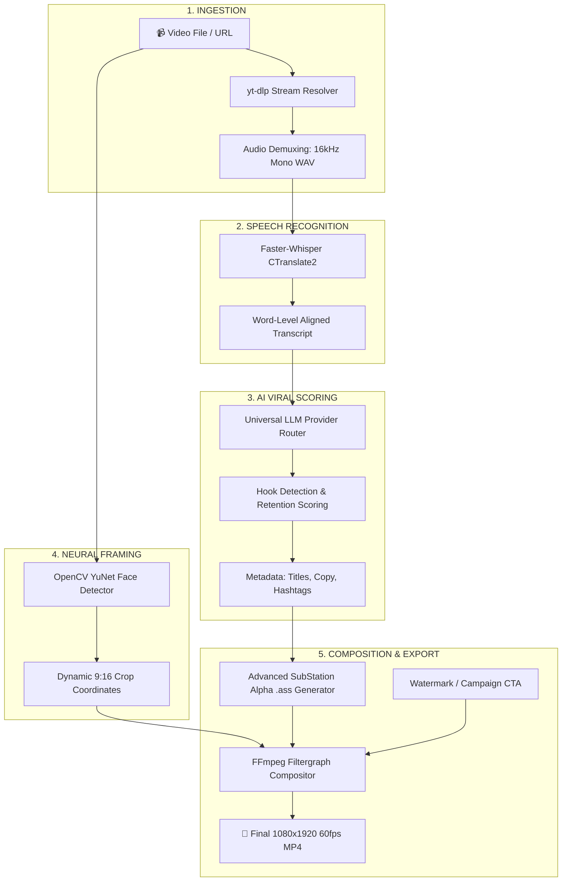

<div align="center">


# 🎬 ClipFarm Studio

### Turn long-form podcasts, interviews, and streams into viral 9:16 vertical shorts with local Faster-Whisper, universal multi-provider LLM scoring, OpenCV YuNet face tracking, and animated kinetic subtitles.

<br/>

[](https://ko-fi.com/santima)

<br/>

[](https://python.org)
[](https://fastapi.tiangolo.com)
[](https://reactjs.org)
[](https://www.typescriptlang.org)
[](https://tauri.app)
[](https://ollama.com)
[](https://www.docker.com/)
[](LICENSE)

<br/>

**[⚡ Quick Start](#-quick-start)** • 
**[✨ Features](#-key-features)** • 
**[🤖 11 AI Engines](#-universal-ai-engine-support)** • 
**[🔄 Architecture](#-pipeline-architecture)** • 
**[💻 Hardware Guide](#-hardware--system-matrix)** • 
**[⚙️ Configuration](#-configuration--environment-variables)** • 
**[🛠️ Troubleshooting](#-troubleshooting--faq)** • 
**[☕ Support](#-support-clipfarm)**

</div>

---

## 📖 Table of Contents

- [🎯 Overview & Philosophy](#-overview--philosophy)
- [✨ Key Features](#-key-features)
- [🔄 Pipeline Architecture](#-pipeline-architecture)
- [🤖 Universal AI Engine Support](#-universal-ai-engine-support)
- [💻 Hardware & System Matrix](#-hardware--system-matrix)
- [⚡ Quick Start](#-quick-start)
  - [Prerequisites](#prerequisites)
  - [Platform Installation (Linux, macOS, Windows)](#platform-installation)
  - [Environment Configuration](#environment-configuration)
  - [One-Click Launch](#one-click-launch)
- [🚀 Execution Modes](#-execution-modes)
  - [1. Shell Scripts (All-in-One Daemon)](#1-shell-scripts-foreground--background)
  - [2. Desktop Application (Tauri & Python GUI)](#2-desktop-application)
  - [3. Docker & Docker Compose](#3-docker--docker-compose)
  - [4. Manual Multi-Terminal Development](#4-manual-multi-terminal-development)
- [⚙️ Configuration & Environment Variables](#-configuration--environment-variables)
- [📱 Step-by-Step User Workflow](#-step-by-step-user-workflow)
- [🧰 CLI & Automation Scripts Reference](#-cli--automation-scripts-reference)
- [🔌 API & Developer Documentation](#-api--developer-documentation)
- [🛠️ Troubleshooting & FAQ](#-troubleshooting--faq)
- [🛣️ Roadmap](#-roadmap)
- [🤝 Contributing & Community](#-contributing--community)
- [☕ Support ClipFarm](#-support-clipfarm)
- [📄 License & Acknowledgments](#-license--acknowledgments)

---

## 🎯 Overview & Philosophy

**ClipFarm Studio** is an open-source, full-stack video automation studio designed for podcasters, streamers, video editing agencies, and content creators. It automates the entire vertical short-form production pipeline: extracting viral narrative hooks from multi-hour footage, re-framing landscape 16:9 into vertical 9:16 with neural face tracking, burning animated karaoke subtitles, and formatting branded call-to-actions.

### Why ClipFarm?

Most commercial clipping SaaS tools (OpusClip, Munch, Klap, Vidyo) share significant drawbacks:
- 💸 **Costly Subscriptions**: $30 to $80/month for limited minutes.
- 🔒 **Data Privacy Concerns**: Proprietary footage, raw podcasts, and unpublished interviews are uploaded to remote cloud infrastructure.
- ⏱️ **Artificial Limits**: Hard caps on video duration, monthly upload minutes, and export resolutions.
- 🌐 **Online Lock-in**: Zero offline capability when working on location or without reliable internet.

**ClipFarm provides an uncompromised, privacy-first alternative:**
- **100% Free & Open Source**: Licensed under MIT with zero hidden watermarks or paywalls.
- **Zero Cloud Costs**: Run entirely offline on your local GPU/CPU using Ollama or LM Studio alongside Faster-Whisper.
- **Complete Privacy**: Videos, audio stems, transcripts, and metadata stay on your local disk.
- **Universal LLM Flexibility**: Switch between local offline models and cloud APIs (DeepSeek, Claude, OpenAI, Groq, Gemini) with a single click.

---

## ✨ Key Features

### 1. Ingestion & Multi-Format Import
- **Direct Video Upload**: Supports MP4, MOV, MKV, AVI, WebM, and high-bitrate ProRes/H.264/H.265 footage.
- **Direct Stream Download**: Paste public YouTube or Bilibili URLs; ClipFarm automatically resolves and downloads the optimal 1080p stream using `yt-dlp`.
- **SRT Transcript Bypass**: Upload existing human-edited subtitles or YouTube `.srt` files to skip transcription and proceed immediately to AI highlight detection.

### 2. Precision Speech-to-Text (Faster-Whisper)
- **Word-Level Timestamps**: Powered by CTranslate2 Faster-Whisper for precise word start/end bounds.
- **Non-Overlapping Mathematical Intervals**: Strict subtitle timestamp guarantees prevent screen-filling text collisions.
- **Anti-Hallucination Tuning**: `condition_on_previous_text=False` eliminates repetitive loop artifacts in long silences or ambient noise.
- **99+ Languages**: Automatic language detection and transcription across English, Spanish, Chinese, French, German, Japanese, and more.

### 3. Universal AI Highlight Extraction
- **Viral Hook Detection**: Identifies compelling narrative hooks, energetic peaks, and self-contained punchlines.
- **Virality Scoring (0–100)**: Evaluates candidate moments across narrative momentum, topic completeness, and emotional resonance.
- **Automatic Copywriting**: Generates platform-tailored titles, descriptions, and hashtag clusters for TikTok, Instagram Reels, YouTube Shorts, and Facebook.

### 4. Neural 9:16 Smart Framing (OpenCV YuNet)
- **Active Speaker Tracking**: Embedded `yunet.onnx` neural vision model tracks faces in real time, automatically centering the speaker in 9:16 vertical cuts.
- **Ambient Blurred Background Fill**: Dynamic background blur fills the vertical 9:16 frame while keeping the original widescreen composition centered.
- **Smooth Panning Transitions**: Anti-jitter trajectory filtering prevents jarring camera jumps during quick head movements.

### 5. Animated Kinetic Subtitles (Libass GPU/CPU)
- **Karaoke Word Animations**: Words illuminate dynamically as they are spoken, matching natural speech cadence.
- **4 Built-in Presets**:
  - ⚡ **Hormozi Yellow**: High-contrast bold uppercase with black stroke and vibrant yellow focus pill.
  - 💥 **MrBeast Pop**: High-energy bouncing highlight font for maximum viewer retention.
  - 🤖 **Cyber Neon**: Electric cyan outline with vivid pink highlight and monospace tech typography.
  - ✍️ **Clean Minimal**: Subtle, elegant editorial dark badge with crisp sans-serif text.
- **Customizable Styling**: Adjust font family, font size, stroke width, primary color, highlight color, and vertical margin offsets.

### 6. Creator Monetization & Brand Campaigns
- **Sponsor Brief Parsing**: Ingest client text briefs or PDF guidelines; automatically parses mandatory talking points, hashtags, and forbidden keywords.
- **Watermark Manager**: Overlay transparent PNG logos in top-left, top-right, or lower-third positions with custom opacity.
- **FTC Disclosure Compliance**: Automatically appends required `#ad` disclosures and campaign hashtags to generated social copy.

### 7. Scalable Asynchronous Architecture
- **Distributed Celery Queue**: Background task workers handle heavy transcription and FFmpeg render jobs without blocking the web UI.
- **Real-Time WebSocket Updates**: Live progress bar updates for audio extraction, Whisper transcription, LLM reasoning, and video encoding.
- **Batch Management**: Multi-select project deletion, mass export, and project archiving.

---

## 🔄 Pipeline Architecture



---

## 🤖 Universal AI Engine Support

ClipFarm includes a **Universal Multi-Provider LLM Router**. Select your desired engine in **Settings > AI Engine** or set `DEFAULT_LLM_PROVIDER` in `.env`:

| Provider | Engine Type | Default Endpoint | Popular Models | Best For |
| :--- | :--- | :--- | :--- | :--- |
| **Ollama** | 🏠 Local / Offline | `http://localhost:11434/v1` | `llama3.2`, `qwen2.5:7b`, `deepseek-r1:8b` | **100% free**, zero network calls, runs on private hardware |
| **LM Studio** | 🏠 Local / Offline | `http://localhost:1234/v1` | Any local GGUF loaded in LM Studio | Visual model switcher, Apple Silicon Metal inference |
| **DeepSeek Direct** | 🌐 Cloud API | `https://api.deepseek.com/v1` | `deepseek-chat` (V3), `deepseek-reasoner` (R1) | Industry-leading reasoning at ultra-low token cost |
| **Anthropic Claude**| 🌐 Cloud API | Native Messages API | `claude-3-5-sonnet`, `claude-3-5-haiku` | Elite creative writing, hook summaries, and title generation |
| **Groq** | 🌐 Cloud API | `https://api.groq.com/openai/v1` | `llama-3.3-70b-versatile` | Ultra-fast inference (500+ tokens/sec) |
| **OpenRouter** | 🌐 Aggregator | `https://openrouter.ai/api/v1` | 200+ models with a single unified key | Access every model in existence with one account |
| **OpenAI** | 🌐 Cloud API | `https://api.openai.com/v1` | `gpt-4o`, `gpt-4o-mini`, `o3-mini` | Gold standard for consistent JSON structured outputs |
| **Google Gemini** | 🌐 Cloud API | Google GenAI SDK | `gemini-2.0-flash`, `gemini-1.5-pro` | Massive context windows for multi-hour video transcripts |
| **Alibaba Qwen** | 🌐 Cloud API | DashScope SDK | `qwen-plus`, `qwen-max` | Native Chinese language transcription and scoring |
| **SiliconFlow** | 🌐 Cloud API | `https://api.siliconflow.cn/v1` | `deepseek-ai/DeepSeek-V3`, `Qwen/Qwen2.5` | High-speed, affordable Chinese and open-source models |
| **Custom OpenAI** | 🌐 Self-Hosted | Custom URL | vLLM, LocalAI, SGLang, Together | Any custom endpoint compatible with `/v1/chat/completions` |

> 💡 **Model Auto-Discovery**: Click **"Fetch available models from endpoint"** in the Settings tab to automatically retrieve and populate all available models from your target provider's `/v1/models` route.

---

## 💻 Hardware & System Matrix

| Execution Profile | Minimum Specs | Recommended Specs | Privacy & Cost |
| :--- | :--- | :--- | :--- |
| **100% Local AI**<br/>*(Local Whisper + Ollama/LM Studio)* | 8-core CPU, 16 GB RAM | Apple Silicon M-Series (M1–M4, 16GB+)<br/>or NVIDIA RTX 3060+ (8 GB+ VRAM), 32 GB RAM | **100% Private, $0 Cost** |
| **Hybrid Mode**<br/>*(Local Whisper + Cloud LLM)* | 4-core CPU, 8 GB RAM | 8-core CPU, 16 GB RAM | High Privacy (audio local, text to cloud), Fractions of a cent/clip |
| **Cloud Mode**<br/>*(Cloud Whisper + Cloud LLM)* | 2-core CPU, 4 GB RAM | Any modern laptop or desktop | Standard API rates, minimal local load |

### Hardware Acceleration Options
- **NVIDIA GPU**: CUDA 11.8 / 12.x + NVENC hardware video encoding.
- **Apple Silicon (Mac)**: Metal Performance Shaders (MPS) + VideoToolbox encoding.
- **Intel / AMD CPU**: Multi-threaded CTranslate2 CPU execution (4 to 16 threads) with libx264 encoding.

---

## ⚡ Quick Start

### Prerequisites
Before running ClipFarm, ensure the following core tools are installed:
- **Python 3.10+** (Python 3.10, 3.11, or 3.12)
- **Node.js 18+** & `npm`
- **FFmpeg & FFprobe** in your system `PATH`
- **Redis Server** (required for background worker queue)
- **Git**

### Platform Installation

#### 🐧 Ubuntu / Debian
```bash
# 1. Install system dependencies
sudo apt update && sudo apt install -y python3 python3-venv python3-pip ffmpeg redis-server nodejs npm git

# 2. Clone repository
git clone https://github.com/santimacorp-droid/ClipFarm.git
cd ClipFarm

# 3. Setup Python virtual environment
python3 -m venv venv
source venv/bin/activate
pip install -r requirements.txt

# 4. Build frontend
cd frontend
npm install
npm run build
cd ..
```

#### 🍏 macOS (Apple Silicon & Intel)
```bash
# 1. Install dependencies via Homebrew
brew install python@3.11 ffmpeg redis node git

# 2. Start Redis service
brew services start redis

# 3. Clone and setup
git clone https://github.com/santimacorp-droid/ClipFarm.git
cd ClipFarm
python3 -m venv venv
source venv/bin/activate
pip install -r requirements.txt

# 4. Build frontend
cd frontend && npm install && npm run build && cd ..
```

#### 🪟 Windows 10 & 11
```powershell
# 1. Install dependencies using Winget
winget install Python.Python.3.11
winget install Gyan.FFmpeg
winget install OpenJS.NodeJS.LTS
winget install Git.Git

# 2. Clone repository
git clone https://github.com/santimacorp-droid/ClipFarm.git
cd ClipFarm

# 3. Run the automated installer wizard
python installer_wizard.py
```
*(Alternatively, use the 1-click `Install_ClipFarm.bat` script).*

---

### Environment Configuration

Copy the example environment file:
```bash
cp .env.example .env
```

*(By default, `.env` is configured for 100% local operation with Ollama and Faster-Whisper. No API keys are required to begin clipping!)*

---

### One-Click Launch

```bash
chmod +x start_clipfarm.sh stop_clipfarm.sh run_all.sh status_clipfarm.sh

# Run all services together in the foreground:
./run_all.sh

# Or start as background background daemons:
./start_clipfarm.sh
```

- 🌐 **Web Studio UI**: [http://localhost:3001](http://localhost:3001)
- 🔌 **Backend API & Swagger Docs**: [http://localhost:8001/docs](http://localhost:8001/docs)

To check health or shut down:
```bash
./status_clipfarm.sh   # Health check all services
./stop_clipfarm.sh     # Clean shutdown
```

---

## 🚀 Execution Modes

### 1. Shell Scripts (Foreground & Background)
- **`./run_all.sh`**: Starts Redis, FastAPI backend, Celery worker, and Vite frontend in a single consolidated terminal process. Press `Ctrl+C` to stop all services simultaneously.
- **`./start_clipfarm.sh`**: Launches services into the background with process tracking via `.pid` files (`backend.pid`, `celery.pid`, `frontend.pid`).
- **`./status_clipfarm.sh`**: Inspects PID health, port bindings, and Redis connectivity.
- **`./stop_clipfarm.sh`**: Safely terminates all background services without orphaned worker tasks.

### 2. Desktop Application
ClipFarm includes both a Python desktop GUI and a native Tauri 2.0 wrapper:

```bash
# Python Desktop Launcher (cross-platform):
python desktop_app.py

# Tauri Native Desktop Wrapper:
cd src-tauri
cargo build --release
```

### 3. Docker & Docker Compose
Deploy ClipFarm with zero manual environment configuration:

```bash
# Start all containers in the background:
docker compose up -d

# View container logs:
docker compose logs -f

# Stop containers:
docker compose down
```

For NVIDIA GPU acceleration in Docker, ensure the [NVIDIA Container Toolkit](https://docs.nvidia.com/datacenter/cloud-native/container-toolkit/install-guide.html) is installed and enable the GPU reservation block in `docker-compose.yml`.

### 4. Manual Multi-Terminal Development
For core contributors developing backend or frontend features:

```bash
# Terminal 1: Redis Server
redis-server

# Terminal 2: FastAPI Backend
source venv/bin/activate
uvicorn backend.main:app --host 0.0.0.0 --port 8001 --reload

# Terminal 3: Celery Task Worker
source venv/bin/activate
celery -A backend.tasks.celery_worker worker --loglevel=info --concurrency=2

# Terminal 4: Frontend Development Server
cd frontend
npm run dev
```

---

## ⚙️ Configuration & Environment Variables

The `.env` file controls all backend ports, model choices, directories, and API keys:

| Environment Variable | Default Value | Description |
| :--- | :--- | :--- |
| `HOST` | `127.0.0.1` | Backend binding address |
| `PORT` | `8001` | FastAPI backend server port |
| `FRONTEND_PORT` | `3001` | React frontend application port |
| `DEBUG` | `True` | Enable debug logs and Swagger UI |
| `DATABASE_URL` | `sqlite:///./clipfarm.db` | SQLite database connection URI |
| `REDIS_URL` | `redis://localhost:6379/0` | Redis broker and cache connection URI |
| `CELERY_BROKER_URL` | `redis://localhost:6379/0` | Celery task message broker |
| `CELERY_RESULT_BACKEND` | `redis://localhost:6379/0` | Celery task result store |
| `CELERY_CONCURRENCY` | `2` | Number of simultaneous video processing workers |
| `DEFAULT_LLM_PROVIDER` | `ollama` | Active LLM engine (`ollama`, `lmstudio`, `claude`, `deepseek`, etc.) |
| `OLLAMA_BASE_URL` | `http://localhost:11434/v1`| Ollama endpoint address |
| `OLLAMA_MODEL` | `llama3.2` | Default model tag pulled in Ollama |
| `LMSTUDIO_BASE_URL` | `http://localhost:1234/v1` | LM Studio local API address |
| `DEEPSEEK_API_KEY` | *(empty)* | DeepSeek platform API key |
| `ANTHROPIC_API_KEY` | *(empty)* | Anthropic Claude API key |
| `OPENAI_API_KEY` | *(empty)* | OpenAI platform API key |
| `GROQ_API_KEY` | *(empty)* | Groq cloud platform API key |
| `OPENROUTER_API_KEY` | *(empty)* | OpenRouter aggregator API key |
| `GEMINI_API_KEY` | *(empty)* | Google AI Gemini API key |
| `DASHSCOPE_API_KEY` | *(empty)* | Alibaba DashScope (Qwen) API key |
| `SILICONFLOW_API_KEY` | *(empty)* | SiliconFlow API key |
| `WHISPER_MODEL` | `small` | Faster-Whisper model tier (`tiny`, `base`, `small`, `medium`, `large-v3`) |
| `WHISPER_DEVICE` | `auto` | Execution device (`cuda`, `mps`, `cpu`, or `auto`) |
| `WHISPER_COMPUTE_TYPE` | `float16` | Precision (`float16`, `int8`, `float32`) |
| `FFMPEG_PATH` | `ffmpeg` | Custom path to FFmpeg binary |
| `OUTPUT_DIR` | `./output` | Output directory for finished vertical clips |

---

## 📱 Step-by-Step User Workflow

1. **Import Video**:
   - Open [http://localhost:3001](http://localhost:3001) in your browser.
   - Paste a YouTube URL or drag and drop a local video file (MP4, MOV, MKV).
   - *(Optional)*: Upload an `.srt` file if you already have a transcript.

2. **Select AI Engine & Thresholds**:
   - Choose your LLM engine (e.g., local Ollama `llama3.2` or cloud DeepSeek).
   - Set the minimum virality threshold score (default: `70/100`).
   - Choose target clip length range (e.g., 30s to 60s).

3. **Configure Framing & Subtitles**:
   - Choose a caption preset: **Hormozi Yellow**, **MrBeast Pop**, **Cyber Neon**, or **Clean Minimal**.
   - Enable or disable the dynamic **Hook Banner** header.
   - Select 9:16 mode: **Smart Face Track** (YuNet), **Blurred Background Fill**, or **Direct Crop**.

4. **Add Brand Assets (Optional)**:
   - In the **Campaigns** tab, attach a sponsor brief or upload a PNG watermark logo.
   - Specify FTC disclosure tags if producing sponsored material.

5. **Process & Export**:
   - Click **Start Processing**.
   - Monitor real-time status across Ingest → Whisper → AI Scoring → 9:16 Render.
   - Preview rendered vertical shorts and download them with one click.

---

## 🧰 CLI & Automation Scripts Reference

| Script | Purpose | Usage |
| :--- | :--- | :--- |
| `run_all.sh` | Foreground consolidated runner for all services | `./run_all.sh` |
| `start_clipfarm.sh` | Starts background daemons with PID tracking | `./start_clipfarm.sh` |
| `stop_clipfarm.sh` | Cleanly stops all background daemons | `./stop_clipfarm.sh` |
| `status_clipfarm.sh` | Health check for Redis, backend, and Celery | `./status_clipfarm.sh` |
| `quick_start.sh` | Fast development launcher | `./quick_start.sh` |
| `install.sh` | Automated Linux system dependencies setup | `bash install.sh` |
| `installer_wizard.py`| Cross-platform interactive setup wizard | `python installer_wizard.py` |
| `check_whisper_status.sh` | Verifies Faster-Whisper GPU/CPU availability | `./check_whisper_status.sh` |
| `desktop_app.py` | Standalone Python desktop GUI | `python desktop_app.py` |

---

## 🔌 API & Developer Documentation

FastAPI automatically generates interactive OpenAPI documentation:
- **Interactive Swagger UI**: [http://localhost:8001/docs](http://localhost:8001/docs)
- **ReDoc UI**: [http://localhost:8001/redoc](http://localhost:8001/redoc)

### Primary REST Endpoints:
- `POST /api/v1/videos/upload`: Upload local video file.
- `POST /api/v1/videos/url`: Ingest video from YouTube or Bilibili URL.
- `GET /api/v1/videos/{video_id}/status`: Query pipeline progress and Celery task state.
- `GET /api/v1/videos/{video_id}/highlights`: Retrieve AI-detected viral candidate moments.
- `POST /api/v1/subtitles/render`: Trigger 9:16 Libass burn and export.
- `GET /api/v1/settings`: Fetch and update active LLM, Whisper, and framing configurations.
- `GET /api/v1/settings/models`: Auto-discover models from active provider's `/v1/models` route.
- `POST /api/v1/campaigns`: Create sponsor brief, attach watermarks, and set compliance tags.

---

## 🛠️ Troubleshooting & FAQ

### 1. `ffmpeg` or `ffprobe` is not found
- **Linux**: Run `sudo apt install -y ffmpeg` (Debian/Ubuntu) or `sudo pacman -S ffmpeg` (Arch).
- **macOS**: Run `brew install ffmpeg`.
- **Windows**: Run `winget install Gyan.FFmpeg`, then restart your terminal to reload your system `PATH`.
- Alternatively, define the explicit path in `.env`: `FFMPEG_PATH="C:/ffmpeg/bin/ffmpeg.exe"`.

### 2. CUDA Out of Memory (OOM) during Whisper
- If running on a GPU with 4GB to 6GB VRAM, switch `WHISPER_MODEL` from `large-v3` to `small` or `base` in `.env` or Settings.
- Set `WHISPER_COMPUTE_TYPE=int8` in `.env` to cut memory usage by half with minimal loss in accuracy.
- Reduce `CELERY_CONCURRENCY=1` to prevent multiple simultaneous Whisper models from loading into VRAM.

### 3. YouTube Download Error: `HTTP 403 Forbidden` / Bot Detection
- YouTube occasionally blocks server requests. ClipFarm uses `yt-dlp`.
- Update `yt-dlp` to the latest version:
  ```bash
  source venv/bin/activate
  pip install --upgrade yt-dlp
  ```
- If your IP is rate-limited, export your browser cookies to a `cookies.txt` file and place it in the project root.

### 4. Port 8001 or 3001 already in use
- Change `PORT=8002` or `FRONTEND_PORT=3002` in `.env`.
- Or terminate the conflicting process:
  ```bash
  # Linux / macOS:
  lsof -ti:8001 | xargs kill -9
  lsof -ti:3001 | xargs kill -9
  ```

### 5. Redis connection refused
- Ensure Redis is running:
  ```bash
  # Linux:
  sudo systemctl start redis-server
  # macOS:
  brew services start redis
  ```

---

## 🛣️ Roadmap

- [x] Multi-provider LLM Engine with dynamic `/v1/models` auto-discovery
- [x] OpenCV YuNet 9:16 smart face tracking (`yunet.onnx`)
- [x] Libass animated kinetic karaoke subtitle styling (Hormozi, MrBeast, Neon, Minimal)
- [x] Sponsor campaign brief parsing and logo watermark manager
- [x] Cross-platform desktop bundles (Tauri 2.0 & Python GUI)
- [ ] Multi-speaker split-screen layout for 2-person debate podcasts
- [ ] Direct publishing integrations (YouTube Shorts, TikTok, and Instagram Graph API)
- [ ] Sound effects (SFX) and background music auto-ducking library
- [ ] Visual timeline subtitle re-timing editor in the web studio UI

For more details, see [ROADMAP.md](ROADMAP.md).

---

## 🤝 Contributing & Community

Contributions are warmly welcomed! Whether fixing a bug, adding a new subtitle preset, or improving documentation:

1. **Fork the Repository**
2. **Create a Feature Branch**: `git checkout -b feature/amazing-feature`
3. **Commit your Changes**: `git commit -m 'Add amazing feature'`
4. **Push to the Branch**: `git push origin feature/amazing-feature`
5. **Open a Pull Request**

Please review [CONTRIBUTING.md](CONTRIBUTING.md) and [CODE_OF_CONDUCT.md](CODE_OF_CONDUCT.md) before submitting code.

---

## ☕ Support ClipFarm

ClipFarm is an independent, community-driven open-source project. If ClipFarm saves you hours of manual editing or powers your content business, please consider supporting ongoing development:

<table>
  <tr>
    <td width="130" align="center">
      
    </td>
    <td>
      <h3>❤️ Support on Ko-fi</h3>
      <p>Your support directly funds test infrastructure, GPU benchmark environments, and continuous open-source maintenance.</p>
      <a href="https://ko-fi.com/santima" target="_blank" rel="noopener">
        
      </a>
      &nbsp;&nbsp;
      <a href="https://ko-fi.com/santima" target="_blank" rel="noopener"><b>👉 ko-fi.com/santima</b></a>
    </td>
  </tr>
</table>

---

## 📄 License & Acknowledgments

This project is licensed under the **[MIT License](LICENSE)**.

### Prior Art & Credits:
- ClipFarm adapts foundational video cutting and task queuing patterns from the open-source [autoclip](https://github.com/zhouxiaoka/autoclip) project under the MIT License.
- Subtitle rendering is powered by [libass](https://github.com/libass/libass).
- Face detection utilizes the [OpenCV YuNet](https://github.com/opencv/opencv_zoo/tree/master/models/face_detection_yunet) ONNX architecture.
- Speech recognition is powered by [Faster-Whisper](https://github.com/SYSTRAN/faster-whisper) (CTranslate2).

<div align="center">
  <sub>Made with ❤️ for content creators and video developers worldwide.</sub>
</div>
